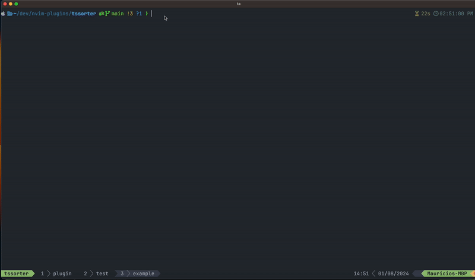

# Overview

Sort *almost any* structured text in Neovim using TSSorter, a sorter for Neovim based on Treesitter nodes. This plugin looks for the nearest configured sortable under the cursor and sorts them under the common parent node, maintaining your original
document structure! It strives to work out of the box with minimal configuration. Please see below for examples:

<p align='center'>
    
</p>

**Note that this plugin is still in the early stages and highly experimental. Breaking changes and bugs should be expected.**
If you find any bugs please submit an issue.

# Installation

TSsorter supports the latest stable release of Neovim, currently version `0.10.1.` Other versions may work but are not guaranteed.

This plugin depends on Treesitter so make sure to install the parser for the filetype you are trying to configure!

You can install using your favorite package manager, here are a few examples:

## Lazy.nvim

```lua
{
    'mtrajano/tssorter.nvim',
    version = '*', -- latest stable version, use `main` to keep up with the latest changes
    ---@module "tssorter"
    ---@type TssorterOpts
    opts = {
        -- leave empty for the default config or define your own sortables in here. They will add, rather than
        -- replace, the defaults for the given filetype
    }
}
```

## Packer

```lua
use {
    'mtrajano/tssorter.nvim',
    tag = '*', -- latest stable version, use `main` to keep up with the latest changes
    config = function()
        require('tssorter').setup({
            -- leave empty for the default config or define your own sortables in here. They will add, rather than
            -- replace, the defaults for the given filetype
        })
    end
  }
```

# Usage

## Default Configuration

The default included sortables can be found [here](https://github.com/mtrajano/tssorter.nvim/blob/main/lua/tssorter/config.lua) which should give you an idea of how to configure your own.
Here is an explanation of what each key means:

```lua
{
   sortables = {
      markdown = { -- filetype
         list = { -- sortable name
            node = 'list_item', -- treesitter node to capture

            ordinal = 'inline', -- OPTIONAL: nested node to do the sorting by. If this is not specified it will just sort based on 
                                -- node's text contents.

            -- It's possible that for the ordinal config above the node name could be one of multiple values. For example in markdown
            -- if you would like to sort by the task status this value could be `task_list_marker_unchecked` or `task_list_marker_checked`
            -- depending on that task status. In this case you could pass a table to ordinal and it would match based on the first one found.
            -- ordinal = {'task_list_marker_unchecked', 'task_list_marker_checked'}

            -- OPTIONAL: function that takes in two nodes and returns true when first node should come first
            -- these are just tsnodes so you have all that functionality available to you
            -- if ordinals are specified in the config above they will be included at the end
            order_by = function(node1, node2, ordinal1, ordinal2)
                if ordinal1 and ordinal2 then
                    return ordinal1 < ordinal2
                end

               -- TODO: add more helpers to make it easier to interact with these
               local line1 = require('tssorter.tshelper').get_text(node1)
               local line2 = require('tssorter.tshelper').get_text(node2)

               return line1 < line2
            end
         }
      }
   },
   logger = {
      level = vim.log.levels.WARN, -- log on warn level and above
      outfile = nil, -- nil prints to messages, or add a path to a file to output logs there
   }

}
```

## Lua API

By default simply calling `sort` should sort the nearest sortable under the cursor.

```lua
require('tssorter').sort()
```

The method also takes some optional parameters to control which direction to sort by, etc...

```lua
require('tssorter').sort({
    reverse = true -- sort in reverse order
    sortable = 'heading' -- find this specific sortable nearest to the cursor
})
```

## Command

For ease of use there is also a `TSSort` command available to you. You may find this easier to you specially when specifying
sortable options. Note that for now you need to explicitly specify which sortable you want to sort by.

```vim
:TSSort heading reverse=true
```

In the example above only the heading sortable name is required. 

You may add your own keybindings to make it easier to call these.

# Examples

For brevity I am not including the entire configuration. Assume that these are all included under the appropriate
filetype in the sortables config key. See above for more details on configuration. Also note that for now all sortables **must
include a sortable name as a key**. This is so that you are able to specify which sortable you want to sort by. Specifying the key
can prevent ambiguity when sorting the same node with different ordinals and ordering rules. For example, having the ability 
to specify that you want to sort headers with `:TSSorter heading`.

## Sorting CSS properties
```lua
{
    node = 'declaration',
}
```

## Sorting HTML attributes
```lua
{
    node = 'attribute',
}
```

## Sorting by markdown headers
```lua
{
    node = 'section',
}
```

## Sorting by markdown lists/tasks
```lua
{
    node = 'list_item',
}
```

## Lua lists
```lua
{
    node = 'field',
}
```

---

Yada yada yada, you get the idea... Essentially all you need is to add the node you want to sort on. If this node
contains a nested structure, for example markdown headers, make sure the node you define is the one that encapsulates
all of the nested nodes. In the example of markdown headers this is the `section` node and not the `atx_heading` node
itself!

# TODO

- [x] Fix undo/redo to be one operation rather than line by line
- [ ] Sort under visual selection / range
- [ ] Add more default configuration for other languages
- [ ] Vim /doc documentation
- [ ] Tests
- [ ] Look into query `.scm` files
- [ ] Sort recursively
- [x] Sort based on a configurable inner node, example
    * Sort function based on the identifier (function_name)
    * Inner text of the markdown list (rather than the whole list)

# Contribution

See an interesting use case you don't see mentioned here or that is not yet implemented? Create an issue or submit a pr!
Any help adding documentation would also be appreciated.
